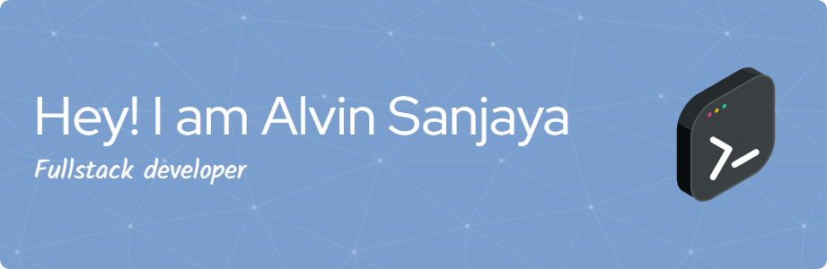

<h1 align="center">Hey 👋What's Up? I'M Alvin Sanjaya</h1>

###

  
  
  
  
  
  
  
  
  
  
  
  
  
  
  
  
  
  
  
  
  
  
  

###

  
  <!--  -->
  

###

  
  

###

<picture>
  <source media="(prefers-color-scheme: dark)" srcset="https://raw.githubusercontent.com/alvinsanjaya14/alvinsanjaya14/output/pacman-contribution-graph-dark.svg">
  <source media="(prefers-color-scheme: light)" srcset="https://raw.githubusercontent.com/alvinsanjaya14/alvinsanjaya14/output/pacman-contribution-graph.svg">
  
</picture>

###